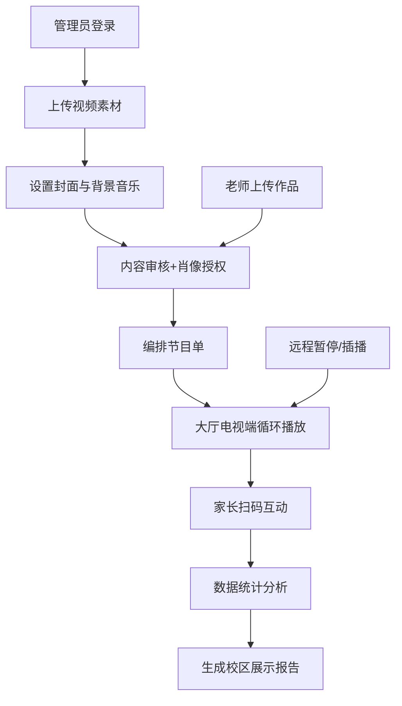

## 1. 产品概述

舞蹈培训机构短视频电视端展示平台，用于机构大厅循环播放学员舞蹈作品，提升品牌形象，促进家长互动与课程转化。

- 面向舞蹈培训机构的展示类应用，部署于大厅电视设备
- 核心价值：展示教学成果、增强家长参与度、促进课程咨询与报名
- 目标用户：机构管理者、老师、学员及来访家长

## 2. 核心功能

### 2.1 用户角色

| 角色 | 登录方式 | 核心权限 |
|------|----------|----------|
| 机构管理员 | 账号密码登录 | 全部模块管理权限，节目单编排，素材管理，审核，数据统计，报告生成 |
| 老师 | 账号密码登录 | 素材上传，节目单查看，审核辅助 |
| 家长/访客 | 无需登录 | 观看视频，扫码互动，投票点赞，查看报名入口 |

### 2.2 功能模块

1. **节目单模块**：班级管理、主题编排、时长设置、播放顺序拖拽
2. **素材模块**：视频上传（横竖屏）、封面管理、背景音乐库
3. **审核模块**：肖像授权标记、内容审核、屏蔽管理
4. **播放模块**：循环播放、插播、静音、跳过、远程暂停
5. **互动模块**：二维码展示、投票、点赞、报名入口
6. **数据模块**：播放统计、热门作品、扫码统计、咨询统计、设备状态、校区报告

### 2.3 页面详情

| 页面名称 | 模块名称 | 功能描述 |
|-----------|-------------|---------------------|
| 播放主页 | 视频播放区 | 大屏视频播放，自动循环，支持横竖屏适配 |
| 播放主页 | 互动悬浮层 | 右下角二维码，左下角点赞/投票，右下角报名入口 |
| 节目单管理 | 节目单列表 | 展示所有节目，支持拖拽排序，编辑班级/主题/时长 |
| 节目单管理 | 班级管理 | 新增/编辑/删除班级，关联学员信息 |
| 素材管理 | 视频库 | 横竖屏视频列表，上传，预览，封面设置 |
| 素材管理 | 音乐库 | 背景音乐列表，上传，试听，音量调节 |
| 审核中心 | 待审核列表 | 未审核素材，肖像授权标记，通过/驳回操作 |
| 审核中心 | 已屏蔽列表 | 已屏蔽内容，恢复/删除操作 |
| 播放控制 | 控制面板 | 播放/暂停，上一个/下一个，静音，循环模式，插播 |
| 播放控制 | 远程控制 | 生成远程控制二维码，手机扫码控制播放 |
| 互动中心 | 投票管理 | 创建投票，查看投票结果，重置投票 |
| 互动中心 | 报名配置 | 设置报名链接，展示样式，咨询电话 |
| 数据统计 | 概览仪表盘 | 播放次数，热门作品TOP10，扫码人数，咨询量 |
| 数据统计 | 设备管理 | 设备在线状态，最后活跃时间，设备绑定 |
| 数据统计 | 报告生成 | 按校区/时间范围生成展示报告，导出PDF |

## 3. 核心流程

**主要用户流程：**
1. 管理员登录系统，上传学员舞蹈视频素材
2. 为视频设置封面图和背景音乐
3. 审核内容完整性，标记肖像授权状态
4. 按班级、主题编排节目单，设置播放顺序和时长
5. 电视端自动循环播放节目单内容
6. 家长观看时可扫码投票、点赞、查看课程报名
7. 系统实时统计播放数据和互动数据
8. 管理员可按校区生成展示报告，用于运营分析

## 4. 用户界面设计

### 4.1 设计风格

**整体风格：** 舞台艺术感 + 现代简约
- 主色调：深邃墨黑 (#0A0A0F) 作为背景，营造剧场氛围
- 点缀色：舞台金 (#D4AF37) 作为高光，霓虹洋红 (#FF006E) 作为活力点缀
- 辅助色：渐变紫 (#6366F1 → #A855F7) 用于按钮和高亮
- 背景：深色渐变 + 微妙的舞台网格纹理
- 按钮：圆角矩形，玻璃拟态效果，悬停时有霓虹光晕
- 字体：标题使用具有设计感的衬线/艺术字体，正文使用现代无衬线字体
- 图标：线性图标，发光效果
- 动效：入场渐显，卡片悬浮，视频切换时的淡入淡出

### 4.2 页面设计概述

| 页面名称 | 模块名称 | UI 元素 |
|-----------|-------------|-------------|
| 播放主页 | 视频播放区 | 全屏视频，上下渐变遮罩，班级信息标签，倒计时进度条 |
| 播放主页 | 互动悬浮层 | 二维码卡片（带脉冲动画），点赞按钮（心形粒子效果），报名按钮（发光边框） |
| 节目单管理 | 节目单列表 | 时间轴布局，拖拽手柄，时长徽章，状态标签（待播/播放中/已播） |
| 素材管理 | 视频卡片 | 封面缩略图，播放时长角标，横竖屏标识，审核状态标签 |
| 审核中心 | 审核列表 | 双栏布局，左侧待审核，右侧预览，授权开关，通过/驳回按钮 |
| 数据统计 | 仪表盘 | 大数字卡片（带上升/下降动画），环形进度图，柱状图，热力图 |
| 播放控制 | 控制面板 | 底部控制栏，半透明玻璃效果，大尺寸按钮，进度条 |

### 4.3 响应式

- **桌面优先设计**：主要面向电视大屏（1920×1080及以上）
- **管理后台**：适配 1280px 以上桌面端
- **电视端**：优化大屏显示，字体放大，对比度增强，适合远距离观看
- **移动端适配**：远程控制页面适配手机屏幕

### 4.4 动效设计

- **页面入场**：元素从下往上渐显，错开 100ms 延迟
- **视频切换**：当前视频淡出 → 下一个视频淡入，伴随轻微缩放
- **点赞动效**：点击心形，心形放大并伴随粒子飞散
- **二维码脉冲**：二维码周围有缓慢扩散的光环动画
- **数据更新**：数字滚动动画，图表渐入
- **卡片悬停**：轻微上浮，阴影加深，边框发光
