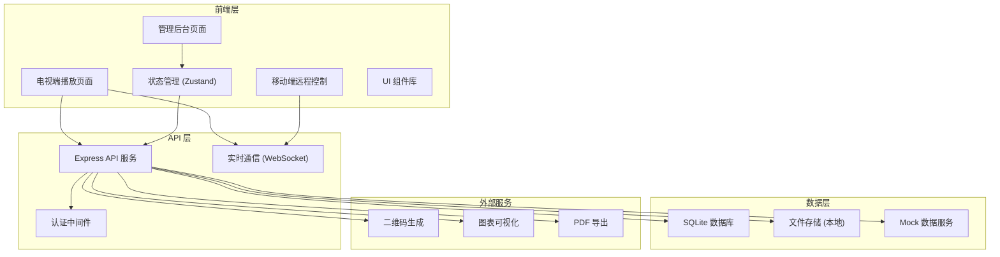
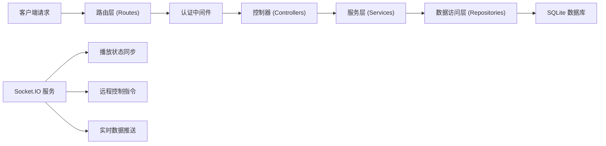
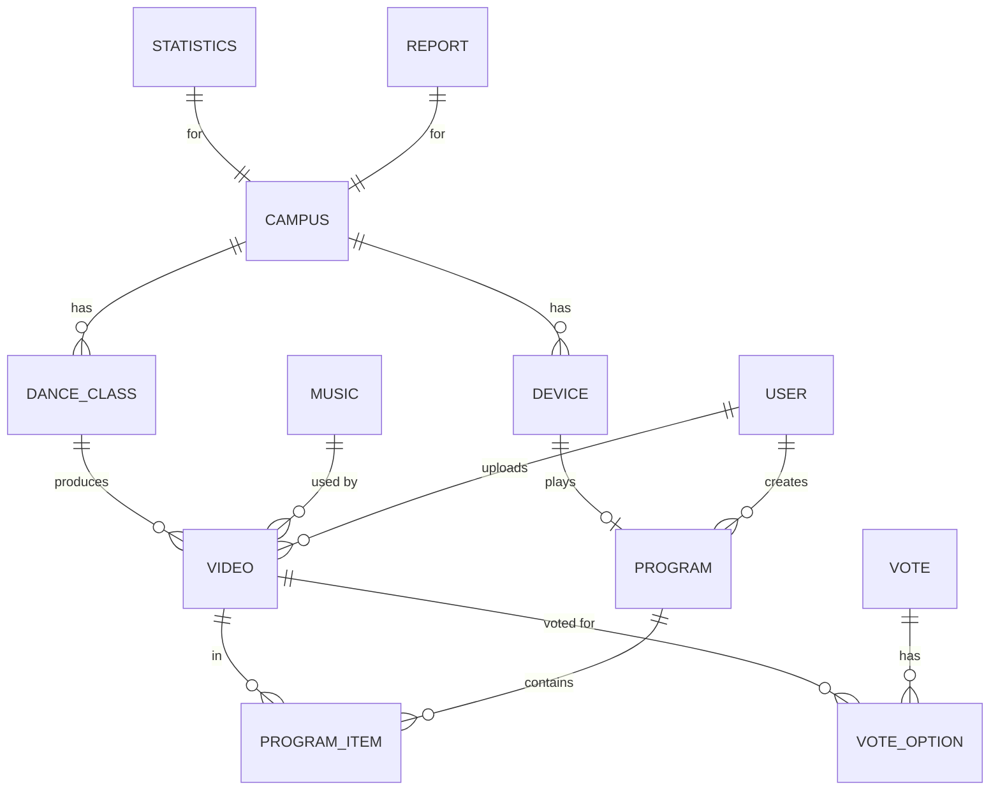

## 1. 架构设计



## 2. 技术描述

- **前端框架**：React@18 + TypeScript
- **构建工具**：Vite@5
- **状态管理**：Zustand
- **路由管理**：React Router DOM@6
- **样式方案**：TailwindCSS@3 + 自定义 CSS 变量
- **图标库**：Lucide React
- **动画库**：Framer Motion
- **图表库**：Recharts
- **后端框架**：Express@4 + TypeScript
- **数据库**：SQLite3 + better-sqlite3
- **实时通信**：Socket.IO
- **二维码生成**：qrcode.react
- **HTTP 客户端**：Axios

## 3. 路由定义

| 路由 | 页面 | 权限 | 说明 |
|-------|------|------|------|
| / | 电视端播放主页 | 公开 | 大屏视频循环播放，互动展示 |
| /player | 全屏播放页 | 公开 | 全屏无干扰播放模式 |
| /login | 登录页 | 公开 | 管理员/老师登录 |
| /admin/dashboard | 管理仪表盘 | 管理员/老师 | 数据概览和快捷操作 |
| /admin/program | 节目单管理 | 管理员/老师 | 编排节目单，管理班级 |
| /admin/materials | 素材管理 | 管理员/老师 | 视频、封面、音乐管理 |
| /admin/review | 审核中心 | 管理员 | 内容审核，肖像授权管理 |
| /admin/playback | 播放控制 | 管理员/老师 | 远程控制播放，插播管理 |
| /admin/interaction | 互动管理 | 管理员 | 投票、报名配置 |
| /admin/statistics | 数据统计 | 管理员 | 播放统计、热门作品、设备状态 |
| /admin/reports | 报告中心 | 管理员 | 校区展示报告生成 |
| /remote/:token | 移动端遥控 | 公开 | 手机扫码远程控制播放 |

## 4. API 定义

### 4.1 TypeScript 类型定义

```typescript
// 视频素材
interface Video {
  id: string;
  title: string;
  classId: string;
  className: string;
  theme: string;
  duration: number;
  orientation: 'portrait' | 'landscape';
  coverUrl: string;
  videoUrl: string;
  bgmId?: string;
  status: 'pending' | 'approved' | 'rejected' | 'blocked';
  portraitAuthorized: boolean;
  playCount: number;
  likeCount: number;
  createdAt: string;
  updatedAt: string;
}

// 班级
interface DanceClass {
  id: string;
  name: string;
  level: string;
  studentCount: number;
  teacher: string;
  campusId: string;
  campusName: string;
}

// 背景音乐
interface Music {
  id: string;
  name: string;
  artist: string;
  duration: number;
  url: string;
  volume: number;
}

// 节目单
interface ProgramItem {
  id: string;
  videoId: string;
  video: Video;
  sortOrder: number;
  scheduledDuration: number;
  status: 'pending' | 'playing' | 'played' | 'skipped';
  playedAt?: string;
}

interface Program {
  id: string;
  name: string;
  campusId: string;
  items: ProgramItem[];
  loopMode: 'single' | 'list' | 'random';
  isActive: boolean;
}

// 投票
interface Vote {
  id: string;
  title: string;
  options: VoteOption[];
  isActive: boolean;
  endAt: string;
}

interface VoteOption {
  id: string;
  text: string;
  count: number;
}

// 报名配置
interface EnrollmentConfig {
  phone: string;
  wechatQr: string;
  description: string;
  buttonText: string;
}

// 播放设备
interface Device {
  id: string;
  name: string;
  campusId: string;
  isOnline: boolean;
  lastActive: string;
  currentProgramId?: string;
  ipAddress: string;
}

// 统计数据
interface Statistics {
  totalPlays: number;
  todayPlays: number;
  totalScans: number;
  totalConsultations: number;
  topVideos: { videoId: string; title: string; playCount: number }[];
  deviceStatus: { online: number; offline: number };
}

// 校区报告
interface CampusReport {
  id: string;
  campusId: string;
  campusName: string;
  startDate: string;
  endDate: string;
  totalPlays: number;
  totalLikes: number;
  totalScans: number;
  popularVideos: Video[];
  generatedAt: string;
}
```

### 4.2 API 接口

| 方法 | 路径 | 说明 |
|------|------|------|
| POST | /api/auth/login | 用户登录 |
| GET | /api/videos | 获取视频列表 |
| POST | /api/videos | 上传视频 |
| PUT | /api/videos/:id | 更新视频信息 |
| DELETE | /api/videos/:id | 删除视频 |
| PATCH | /api/videos/:id/approve | 审核通过 |
| PATCH | /api/videos/:id/reject | 审核驳回 |
| PATCH | /api/videos/:id/authorize | 标记肖像授权 |
| GET | /api/classes | 获取班级列表 |
| POST | /api/classes | 创建班级 |
| PUT | /api/classes/:id | 更新班级 |
| DELETE | /api/classes/:id | 删除班级 |
| GET | /api/music | 获取音乐列表 |
| POST | /api/music | 上传音乐 |
| GET | /api/programs | 获取节目单列表 |
| POST | /api/programs | 创建节目单 |
| PUT | /api/programs/:id | 更新节目单 |
| PUT | /api/programs/:id/items | 更新节目单项目排序 |
| GET | /api/programs/active | 获取当前播放节目单 |
| GET | /api/devices | 获取设备列表 |
| PATCH | /api/devices/:id/heartbeat | 设备心跳 |
| POST | /api/playback/next | 播放下一个 |
| POST | /api/playback/pause | 暂停播放 |
| POST | /api/playback/resume | 恢复播放 |
| POST | /api/playback/skip | 跳过当前 |
| POST | /api/playback/insert | 插播视频 |
| GET | /api/votes | 获取投票列表 |
| POST | /api/votes | 创建投票 |
| POST | /api/votes/:id/vote | 提交投票 |
| GET | /api/enrollment | 获取报名配置 |
| PUT | /api/enrollment | 更新报名配置 |
| POST | /api/scan | 记录扫码 |
| POST | /api/consultation | 记录咨询 |
| POST | /api/like | 点赞视频 |
| GET | /api/statistics/overview | 获取统计概览 |
| GET | /api/statistics/campus/:id | 获取校区统计 |
| POST | /api/reports | 生成报告 |
| GET | /api/reports/:id/download | 下载报告 |

## 5. 服务器架构



## 6. 数据模型

### 6.1 ER 图



### 6.2 DDL 语句

```sql
-- 校区表
CREATE TABLE campus (
  id TEXT PRIMARY KEY,
  name TEXT NOT NULL,
  address TEXT,
  phone TEXT,
  created_at TEXT DEFAULT CURRENT_TIMESTAMP
);

-- 用户表
CREATE TABLE user (
  id TEXT PRIMARY KEY,
  username TEXT UNIQUE NOT NULL,
  password TEXT NOT NULL,
  role TEXT NOT NULL CHECK (role IN ('admin', 'teacher')),
  name TEXT NOT NULL,
  campus_id TEXT REFERENCES campus(id),
  created_at TEXT DEFAULT CURRENT_TIMESTAMP
);

-- 班级表
CREATE TABLE dance_class (
  id TEXT PRIMARY KEY,
  name TEXT NOT NULL,
  level TEXT,
  student_count INTEGER DEFAULT 0,
  teacher TEXT,
  campus_id TEXT REFERENCES campus(id),
  created_at TEXT DEFAULT CURRENT_TIMESTAMP
);

-- 音乐表
CREATE TABLE music (
  id TEXT PRIMARY KEY,
  name TEXT NOT NULL,
  artist TEXT,
  duration INTEGER NOT NULL,
  url TEXT NOT NULL,
  volume REAL DEFAULT 1.0,
  created_at TEXT DEFAULT CURRENT_TIMESTAMP
);

-- 视频表
CREATE TABLE video (
  id TEXT PRIMARY KEY,
  title TEXT NOT NULL,
  class_id TEXT REFERENCES dance_class(id),
  theme TEXT,
  duration INTEGER NOT NULL,
  orientation TEXT NOT NULL CHECK (orientation IN ('portrait', 'landscape')),
  cover_url TEXT NOT NULL,
  video_url TEXT NOT NULL,
  bgm_id TEXT REFERENCES music(id),
  status TEXT NOT NULL DEFAULT 'pending' CHECK (status IN ('pending', 'approved', 'rejected', 'blocked')),
  portrait_authorized INTEGER DEFAULT 0,
  play_count INTEGER DEFAULT 0,
  like_count INTEGER DEFAULT 0,
  uploaded_by TEXT REFERENCES user(id),
  created_at TEXT DEFAULT CURRENT_TIMESTAMP,
  updated_at TEXT DEFAULT CURRENT_TIMESTAMP
);

-- 节目单表
CREATE TABLE program (
  id TEXT PRIMARY KEY,
  name TEXT NOT NULL,
  campus_id TEXT REFERENCES campus(id),
  loop_mode TEXT NOT NULL DEFAULT 'list' CHECK (loop_mode IN ('single', 'list', 'random')),
  is_active INTEGER DEFAULT 0,
  created_at TEXT DEFAULT CURRENT_TIMESTAMP
);

-- 节目单项目表
CREATE TABLE program_item (
  id TEXT PRIMARY KEY,
  program_id TEXT REFERENCES program(id) ON DELETE CASCADE,
  video_id TEXT REFERENCES video(id),
  sort_order INTEGER NOT NULL,
  scheduled_duration INTEGER,
  status TEXT DEFAULT 'pending' CHECK (status IN ('pending', 'playing', 'played', 'skipped')),
  played_at TEXT
);

-- 设备表
CREATE TABLE device (
  id TEXT PRIMARY KEY,
  name TEXT NOT NULL,
  campus_id TEXT REFERENCES campus(id),
  is_online INTEGER DEFAULT 0,
  last_active TEXT,
  current_program_id TEXT REFERENCES program(id),
  ip_address TEXT,
  created_at TEXT DEFAULT CURRENT_TIMESTAMP
);

-- 投票表
CREATE TABLE vote (
  id TEXT PRIMARY KEY,
  title TEXT NOT NULL,
  is_active INTEGER DEFAULT 1,
  end_at TEXT,
  created_at TEXT DEFAULT CURRENT_TIMESTAMP
);

-- 投票选项表
CREATE TABLE vote_option (
  id TEXT PRIMARY KEY,
  vote_id TEXT REFERENCES vote(id) ON DELETE CASCADE,
  text TEXT NOT NULL,
  count INTEGER DEFAULT 0
);

-- 报名配置表
CREATE TABLE enrollment_config (
  id TEXT PRIMARY KEY,
  phone TEXT,
  wechat_qr TEXT,
  description TEXT,
  button_text TEXT DEFAULT '立即咨询',
  updated_at TEXT DEFAULT CURRENT_TIMESTAMP
);

-- 扫码记录表
CREATE TABLE scan_log (
  id TEXT PRIMARY KEY,
  type TEXT NOT NULL,
  video_id TEXT REFERENCES video(id),
  device_id TEXT REFERENCES device(id),
  created_at TEXT DEFAULT CURRENT_TIMESTAMP
);

-- 咨询记录表
CREATE TABLE consultation_log (
  id TEXT PRIMARY KEY,
  type TEXT NOT NULL,
  video_id TEXT REFERENCES video(id),
  device_id TEXT REFERENCES device(id),
  created_at TEXT DEFAULT CURRENT_TIMESTAMP
);

-- 点赞记录表
CREATE TABLE like_log (
  id TEXT PRIMARY KEY,
  video_id TEXT REFERENCES video(id),
  device_id TEXT REFERENCES device(id),
  created_at TEXT DEFAULT CURRENT_TIMESTAMP
);

-- 播放记录表
CREATE TABLE play_log (
  id TEXT PRIMARY KEY,
  video_id TEXT REFERENCES video(id),
  program_id TEXT REFERENCES program(id),
  device_id TEXT REFERENCES device(id),
  duration_played INTEGER,
  created_at TEXT DEFAULT CURRENT_TIMESTAMP
);

-- 报告表
CREATE TABLE report (
  id TEXT PRIMARY KEY,
  campus_id TEXT REFERENCES campus(id),
  campus_name TEXT NOT NULL,
  start_date TEXT NOT NULL,
  end_date TEXT NOT NULL,
  total_plays INTEGER DEFAULT 0,
  total_likes INTEGER DEFAULT 0,
  total_scans INTEGER DEFAULT 0,
  generated_at TEXT DEFAULT CURRENT_TIMESTAMP
);

-- 初始数据
INSERT INTO campus (id, name, address, phone) VALUES 
('campus_001', '朝阳校区', '北京市朝阳区舞蹈大厦A座', '400-888-0001'),
('campus_002', '海淀校区', '北京市海淀区文化中心B1层', '400-888-0002');

INSERT INTO user (id, username, password, role, name, campus_id) VALUES 
('user_001', 'admin', 'admin123', 'admin', '张老师', 'campus_001'),
('user_002', 'teacher1', '123456', 'teacher', '李老师', 'campus_001');

INSERT INTO dance_class (id, name, level, student_count, teacher, campus_id) VALUES 
('class_001', '少儿芭蕾启蒙班', '初级', 12, '王老师', 'campus_001'),
('class_002', '中国舞基础班', '初级', 15, '李老师', 'campus_001'),
('class_003', '爵士舞进阶班', '中级', 10, '赵老师', 'campus_001'),
('class_004', '街舞高级班', '高级', 8, '孙老师', 'campus_002'),
('class_005', '拉丁舞精英班', '高级', 12, '周老师', 'campus_002');

INSERT INTO enrollment_config (id, phone, wechat_qr, description, button_text) VALUES 
('config_001', '400-888-0001', '', '扫码添加老师微信，获取免费试听课机会！', '立即咨询报名');

INSERT INTO device (id, name, campus_id, is_online, last_active, ip_address) VALUES 
('device_001', '大厅电视-朝阳', 'campus_001', 1, datetime('now'), '192.168.1.100'),
('device_002', '前台电视-朝阳', 'campus_001', 1, datetime('now'), '192.168.1.101'),
('device_003', '大厅电视-海淀', 'campus_002', 0, datetime('now', '-1 hour'), '192.168.2.100');

INSERT INTO vote (id, title, end_at) VALUES 
('vote_001', '本月光影之星评选', datetime('now', '+7 days'));

INSERT INTO vote_option (id, vote_id, text, count) VALUES 
('opt_001', 'vote_001', '《天鹅湖》选段 - 少儿芭蕾班', 28),
('opt_002', 'vote_001', '《茉莉花》中国舞 - 基础班', 35),
('opt_003', 'vote_001', '《Uptown Funk》爵士舞 - 进阶班', 42),
('opt_004', 'vote_001', '《本草纲目》街舞 - 高级班', 51);
```
